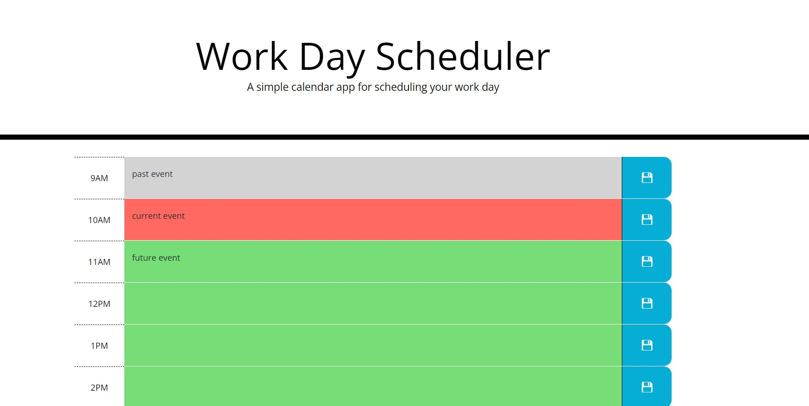

#Workday-Scheduler

This exercise asked us to create a workday scheduling app that allowed a user to click on a text entry area and add an event to the scheduler. 
Clicking the save button stores the information into local storage so that the schedule will repopulate upon re-loading the page. Color coding is added to differentiate between
past, present, and future events. The initial code contained an HTML page with an empty div container where all content would go. I created a JS file and used Jquery to dynamically 
create the elements on the page and allow them to respond to user interactions. 

https://kamadulski999.github.io/Workday-Scheduler/

https://github.com/Kamadulski999/Workday-Scheduler

